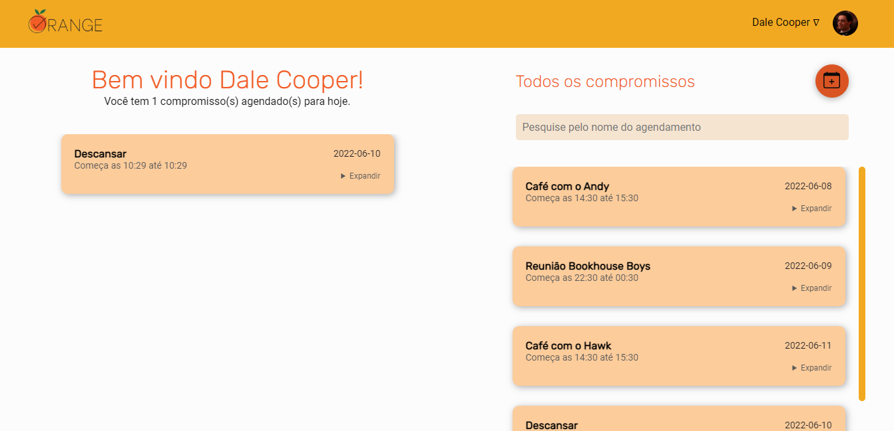

<p align="center">
    
</p>
<h1 align="center">📅 Orange App</h1>

## 💻 Sobre o Projeto

Orange APP é uma aplicação de gerenciamento de agendamento desenvolvido em React.
Para a realização do projeto, foi desenvolvida uma <a href="https://orangeapirest.herokuapp.com/">API</a> utilizando JSON-server.

- [Deploy na Vercel](https://orangeapp.vercel.app/)

 

---

## 📋 Tabela de conteúdo

- [Sobre](#💻-sobre-o-projeto)
- [Tabela de Conteudo](#📋-tabela-de-conteúdo)
- [Funcionalidades](#⚙️-funcionalidades)
- [Inicando o projeto](#🏁-iniciando-o-projeto)
- [Sobre a API](#🗂️-sobre-a-api)
- [Tecnologias utilizadas](#🧰-tecnologias-utilizadas)
  - [Ferramentas](#ferramentas)
  - [Bibliotecas externas](#📦bibliotecas-externas)
  - [Utilitários](#utilitários)
- [Autora](#👽-autora)

---

## ⚙️ Funcionalidades

- [x] Página institucional
- [x] Área de cadastro
- [x] Área de login
- [x] Página do usuário
  - [x] Lista de agendamentos
    - [x] Adicionar agendamento
    - [x] Editar
    - [x] Excluir

## 

## 🏁 Iniciando o projeto

- Clone o repositório

```
https://github.com/vanessacreis/orangeapp.git
```

- Acesse a pasta criada

```
cd orangeapp
```

- Instale os pacotes necessários

```
npm install
```

- Inicie o projeto

```
npm start
```

- A aplicação abre por padrão na porta 3000

```
Acesse http://localhost:3000/
```

---

## 🗂️ Sobre a API

A <a href="https://orangeapirest.herokuapp.com/">API</a> desenvolvida já conta com um perfil criado e com alguns agendamentos adicionados. Para utilizá-lo, faça login com as informações abaixo:

```
Usuário: agentcooper
Senha: coffee123
```

⚠️ O Heroku (plataforma utilizada para deploy) reseta as informações inseridas na API após 45 minutos. Após esse período, só o usuário inicial estará disponível.

---

## 🧰 Tecnologias utilizadas

### Ferramentas

- [Vite](https://vitejs.dev/blog/announcing-vite2.html)
- [React](https://pt-br.reactjs.org/)
- [Node.js](https://nodejs.org/en/)
- [NPM](https://www.npmjs.com/)
- [Typescript](https://www.typescriptlang.org/)

### 📦Bibliotecas externas

- [Animate CSS](https://animate.style/)
- [Dayjs](https://day.js.org/)
- [React Animation On Scroll](https://www.npmjs.com/package/react-animation-on-scroll)
- [React Menu](https://szhsin.github.io/react-menu/)
- [React Router Dom](https://www.npmjs.com/package/react-router-dom)
- [React Toastify](https://www.npmjs.com/package/react-toastify)
- [Styled-components](https://styled-components.com/)

### Utilitários

- [Figma](https://www.figma.com/)
- [Flaticon](https://www.flaticon.com/br/)
- [JSON-Server](https://my-json-server.typicode.com/)
- [Heroku](heroku.com)
- [Storyset](https://storyset.com/)
- [Unsplash](https://unsplash.com/)
- [Vercel](https://vercel.com/)

---

## 👽 Autora

### Desenvolvido com 🧡 por <a href="https://www.linkedin.com/in/vanessacreisbh/">Vanessa Reis</a>.
